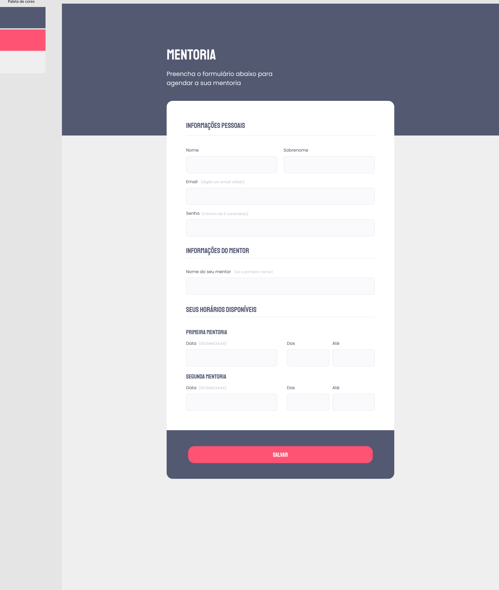

<h1 align="center"> Criando Formulários </h1>

E aí, curtiu aprender mais sobre formulários? 👀  
Bora colocar em prática tudo o que foi visto nessa primeira fase? 😍

  <a href="#-tecnologias">Tecnologias</a>&nbsp;&nbsp;&nbsp;|&nbsp;&nbsp;&nbsp;  
  <a href="#-layout">Layout</a>&nbsp;&nbsp;&nbsp;

 

  

Topa encarar esse desafio? 💜  
Vai ser muito importante para o seu aprendizado rever e aplicar esses novos conceitos.  
 
Lembrando: tente se desafiar e não olhar a resposta mas, caso apareça alguma dificuldade, você pode voltar nas aulas para relembrar algumas dicas!

## 🚀 Tecnologias

Esse projeto foi desenvolvido com as seguintes tecnologias:

- HTML e CSS
- JavaScript
- Git e Github
- Figma

## 🔖 Layout

Você pode visualizar o layout desejado do desafio através [DESSE LINK] https://www.figma.com/file/odO5hdmXdWhkPp3wqkOxOe/Stage-03---Formul%C3%A1rio-intermedi%C3%A1rio-(Copy)?type=design&node-id=0-1&mode=design&t=lSQis0I2R9K3wxQ2-0. É necessário ter conta no [Figma](https://figma.com) para acessá-lo.

---

Feito com ♥ by Rocketseat :wave: [Participe da nossa comunidade!](https://discord.gg/rocketseat)

